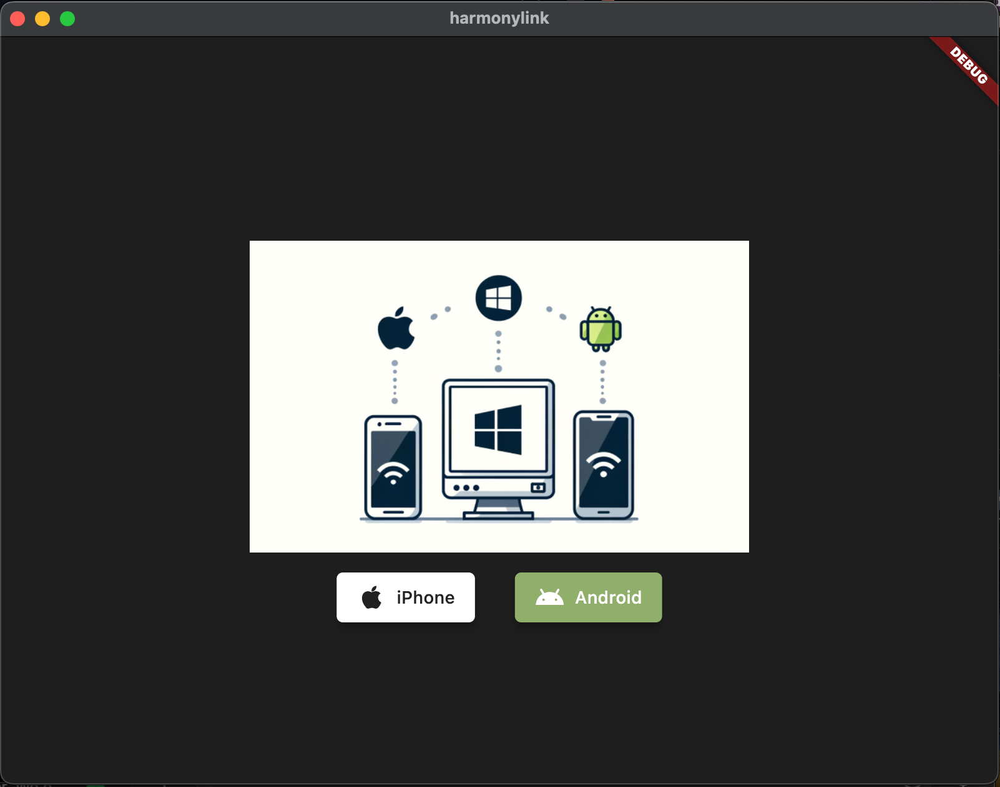

# PC-Link
A Cross-platform app that synchronises the incoming texts and calls from your android phone. 

### App names:
 Mobile: HarmonySync
 PC: HarmonyLink

### Programming Language & Framework

We can use flutter to build native desktop applications which are much better than electron based or react-native implementations. 

For both Mobile and Desktop applications, I will be using Flutter. I'm completely new at the time of writing this but I'll eventually learn and implement the logic for this application. 

### Applcation Architecture

### Finalized Tech Stack

## Contributions / Collaboration

Please reach out to me at [linkedin.com/in/belanasaikiran](https://www.linkedin.com/in/belanasaikiran)
