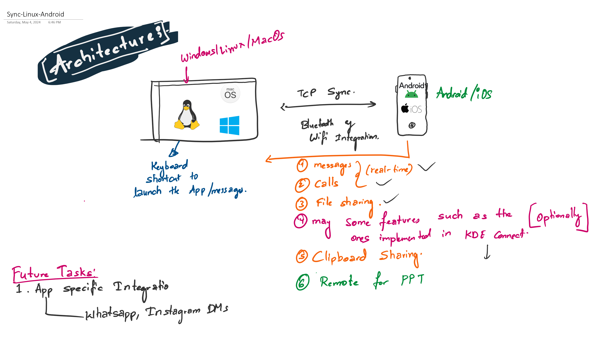

# PC-Link
A Linux app that synchronises the incoming texts and calls from your android phone.


### Architecture



### Tech Stack


### Possile Implementation for GUI:

1. Dear ImGUI:

[Dear ImGui](https://github.com/ocornut/imgui): Bloat-free Graphical User interface for C++ with minimal dependencies. 

Setup for ImGUI:

I'll be using `glut` library for the rendering. 

```bash
sudo apt install freeglut3-dev g++ make cmake
```

[Optionally `x11` for docker container]

```bash
sudo apt install x11 x11-apps
```